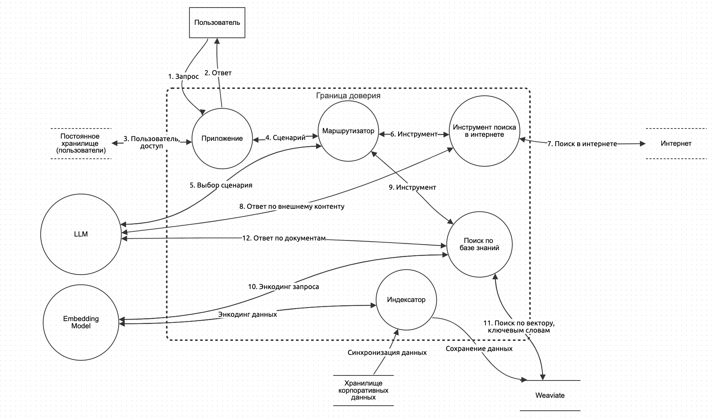

# Simple RAG

Простая RAG-система, рассмотренная на лекции "Уязвимости RAG".
Для инференса *не требуется* GPU, можно запустить ПО на любом компьютере с достаточным (~8 Гб) объёмом RAM.

## Архитектура

Содержит следующие *внутренние* компоненты:

- Само приложение (`main.py`)
- Индексатор - (`rag/modules/index.py`)
- Маршрутизатор (`rag/modules/route.py`)
- Поиск по базе знаний (`rag/modules/search.py`)
- Инструмент поиска в интернете (`rag/modules/internet.py`)

*Внешние* компоненты:

- Векторное хранилище - Weaviate Embedded
- LLM - Mistral 7B OpenOrca GGUF, рекомендуется взять [4-битную квантизацию](https://huggingface.co/TheBloke/Mistral-7B-OpenOrca-GGUF/resolve/main/mistral-7b-openorca.Q4_K_M.gguf)
- Embedding - [multilingual-e5-small](https://huggingface.co/intfloat/multilingual-e5-small)

## Зависимости

- Python 3.11+
- Poetry
- Brave Search API - можно использовать мой ключ, который я выдам в задании, или зарегистрировать свой
- LLM - Mistral 7B OpenOrca GGUF, рекомендуется взять [4-битную квантизацию](https://huggingface.co/TheBloke/Mistral-7B-OpenOrca-GGUF/resolve/main/mistral-7b-openorca.Q4_K_M.gguf)
- Embedding - [multilingual-e5-small](https://huggingface.co/intfloat/multilingual-e5-small)

## Установка

    poetry install --no-root

## Настройка

Настройка производится через переменные окружения, их можно задать в локальном файле `.env`. 
Переменные читаются автоматически при запуске программы (в скобках - значения по умолчанию):

- `INDEX_NAME` (SimpleRag) - название индекса в Weaviate
- `DATA_PATH` (./data) - путь к папке с исходными данными
- `WEAVIATE_DATA_PATH` (./weaviate) - путь к папке, где Weaviate будет хранить данные
- `HYBRID_ALPHA` (0.5) - приоритет векторной части в гибридном поиске. Значение 0.5 - результаты семантического поиска и поиска по ключевым словам равнозначны.
- `WEAVIATE_SEARCH_TOP_K` (2) - максимальное количество результатов при поиске в Weaviate
- `LLM_PATH` (models/mistral-7b-openorca-gguf/q4.gguf) - путь к GGUF-файлу LLM
- `EMBEDDINGS_PATH` (models/multilingual-e5-small) - путь к модели эмбеддингов
- `CHUNK_SIZE` (1024) - размер чанка при разбиении исходных данных
- `CHUNK_OVERLAP` (20) - размер "перекрытия" при разбиении исходных данных
- `BRAVE_SEARCH_API_KEY` (none) - ключ Brave Search API. Хранить ключи в репозитории плохо!

## Запуск

Индексация данных:

    python main.py index

Поиск информации в базе данных:

    python main.py query "what is MERA benchmark for LLM?"

Поиск в интернете:

    python main.py query "как называется столица Буркина-Фасо?"

## Очистка БД

1. "убить" процесс weaviate embedded, если он запущен
2. очистить папку `WEAVIATE_DATA_PATH`

## Задание

1. Определить угрозы и оценить их риск для каждого *внутреннего* компонента (все кружки внутри границы доверия на диаграмме архитектуры). За корректное описание всех угроз для каждого компонента начисляется 1 балл. Всего внутренних компонентов 5, поэтому максимальное количество баллов за этот пункт - 5.
2. Для каждой описанной угрозы описать сценарии реагирования (смягчения). Корректное описание сценариев реагирования для всех угроз 1 компонента оценивается в 1 балл. Максимальное количество баллов за этот пункт - 5 (если описаны варианты реагирования для всех угроз всех компонентов).
3. Бонусные баллы - 5 баллов, если вы сможете запустить этот RAG и продемонстрировать на видео эксплуатацию одной из описанных вами угроз.
